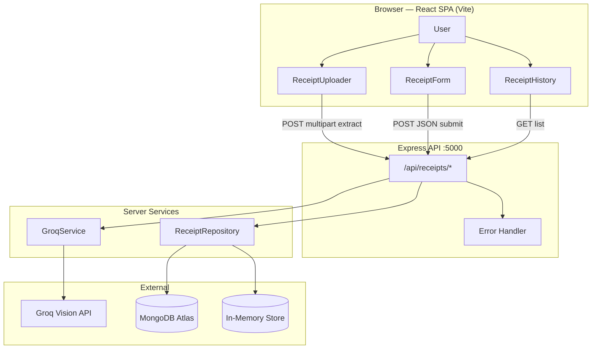
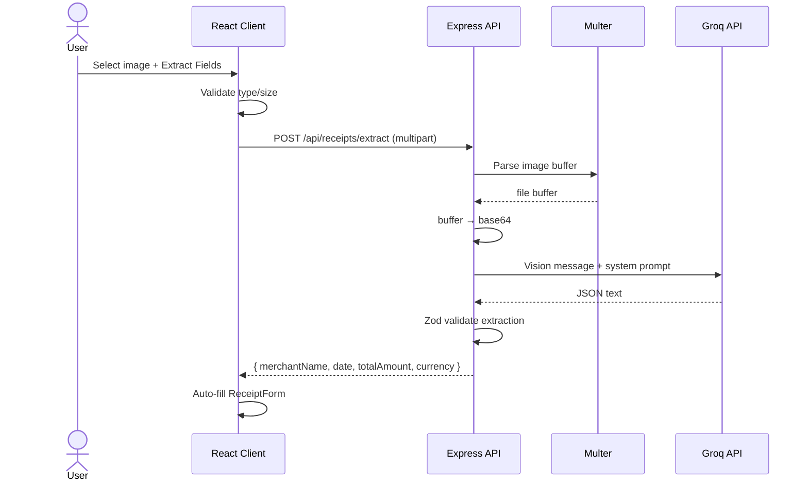
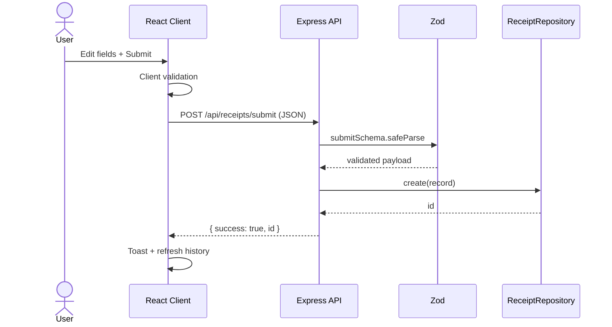
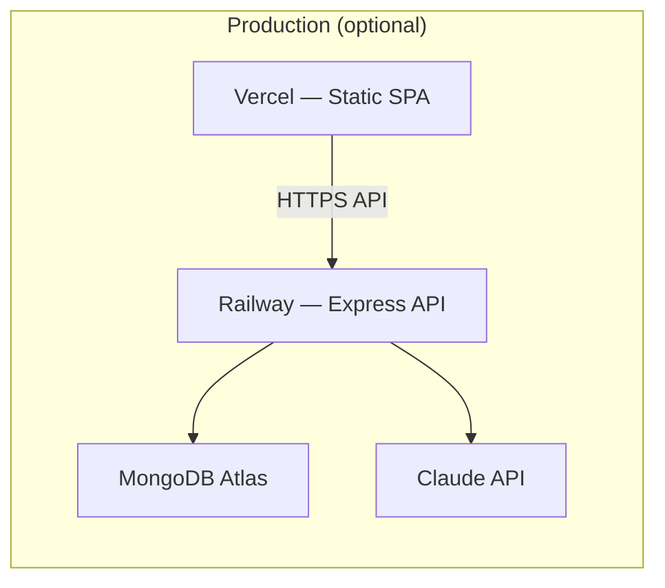

# System Architecture — Receipt-to-Form Auto-Fill

Teleperformance Malaysia · AI Intern Assessment

## 1. Overview

A **3-tier decoupled web application** that accepts receipt images, extracts structured financial fields via a generative AI vision API, presents an editable form for human review, and persists verified submissions.

| Layer | Technology | Responsibility |
|-------|------------|----------------|
| Presentation | React + TypeScript + Tailwind (Vite) | Upload UI, preview, form, toasts, history |
| Backend / DB | Convex (`client/convex/`) | Receipt CRUD, real-time list |
| AI | Google Gemini (browser) | Vision OCR + field extraction |

---

## 2. High-Level Architecture



---

## 3. Component Architecture

### 3.1 Frontend (`client/`)

```
src/
├── pages/HomePage.tsx          # Orchestrates upload → extract → form → submit
├── components/
│   ├── ReceiptUploader.tsx   # Drag-drop, validation, preview, extract CTA
│   ├── ReceiptForm.tsx       # Editable fields + client validation
│   ├── SubmitButton.tsx      # Async submit with spinner
│   ├── ReceiptHistory.tsx    # Saved receipts table (GET /api/receipts)
│   └── Toast.tsx             # Success / error notifications
├── hooks/
│   ├── useReceiptExtract.ts  # POST /extract
│   ├── useReceiptSubmit.ts   # POST /submit
│   └── useReceiptList.ts     # GET /
├── lib/api.ts                # Axios instance (VITE_API_BASE_URL)
└── types/receipt.ts          # Shared TypeScript contracts
```

**State flow**

1. User selects image → local preview (object URL).
2. `useReceiptExtract` → `FormData` → backend → Claude → JSON → `extracted` state.
3. `ReceiptForm` binds to `extracted`; user edits fields.
4. `useReceiptSubmit` → validated JSON → repository → toast + history refresh.

### 3.2 Backend (`server/`)

```
src/
├── routes/receipts.ts           # Route definitions
├── controllers/receiptController.ts
├── services/
│   ├── claudeService.ts         # Vision API + JSON parse + Zod
│   └── receiptRepository.ts     # Storage interface (Mongo | memory)
├── models/Receipt.ts            # Mongoose schema (Mongo mode)
├── middleware/upload.ts         # Multer memory, 5MB, image/*
├── middleware/errorHandler.ts
└── utils/validateExtraction.ts  # Zod schemas (extract + submit)
```

**Repository pattern** — controllers depend on `IReceiptRepository`, not Mongoose directly:

| Mode | Env | Behavior |
|------|-----|----------|
| `mongodb` | `MONGODB_URI` set | Mongoose + Atlas |
| `memory` | No `MONGODB_URI` or `STORAGE_MODE=memory` | In-process array (demo / local) |

---

## 4. Sequence Diagrams

### 4.1 Extract flow



### 4.2 Submit flow



---

## 5. API Contract

| Method | Path | Content-Type | Purpose |
|--------|------|--------------|---------|
| `POST` | `/api/receipts/extract` | `multipart/form-data` (`image`) | AI extraction |
| `POST` | `/api/receipts/submit` | `application/json` | Persist receipt |
| `GET` | `/api/receipts` | — | List all receipts (newest first) |
| `GET` | `/health` | — | Liveness check |

**Extract response (200)**

```json
{
  "merchantName": "AEON Mall",
  "date": "2024-05-18",
  "totalAmount": 123.5,
  "currency": "MYR"
}
```

**Submit response (201)**

```json
{ "success": true, "id": "..." }
```

---

## 6. Data Model

### Extracted / submitted fields

| Field | Type | Rules |
|-------|------|-------|
| `merchantName` | string | Required on submit, trimmed |
| `date` | string | ISO `YYYY-MM-DD` |
| `totalAmount` | number | ≥ 0 |
| `currency` | string | 3-letter uppercase (e.g. MYR) |

### Persisted record (MongoDB / memory)

```typescript
{
  _id: string;
  merchantName: string;
  date: string;
  totalAmount: number;
  currency: string;
  createdAt: string;  // ISO
  updatedAt: string;  // ISO (Mongo only)
}
```

---

## 7. AI Integration

| Property | Value |
|----------|-------|
| Provider | [Groq](https://console.groq.com/docs/vision) |
| Model | `meta-llama/llama-4-scout-17b-16e-instruct` |
| Input | Base64 image + extraction system prompt |
| Output | JSON only (no markdown) |
| Server validation | Zod `extractionSchema` |

Prompt instructs Claude to return:

```json
{"merchantName":"...","date":"YYYY-MM-DD","totalAmount":0,"currency":"MYR"}
```

Null allowed per field when undetermined; API normalizes to empty string / 0 for the form.

---

## 8. Cross-Cutting Concerns

| Concern | Implementation |
|---------|----------------|
| **CORS** | `CLIENT_ORIGIN` (default `http://localhost:5173`) |
| **File upload** | Multer `memoryStorage`, 5MB, JPEG/PNG/WEBP |
| **Validation** | Zod on extract response + submit body |
| **Errors** | `AppError` + global `errorHandler` → `{ error: string }` |
| **Dev proxy** | Vite proxies `/api` → `localhost:5000` |

---

## 9. Deployment Topology



| Target | Service | Env vars |
|--------|---------|----------|
| Frontend | Vercel | `VITE_API_BASE_URL` |
| Backend | Railway | `PORT`, `MONGODB_URI`, `ANTHROPIC_API_KEY`, `CLIENT_ORIGIN` |

Local development: both processes on localhost; storage can run in **memory mode** without Atlas.

---

## 10. Assessment Alignment

| Requirement | Implementation |
|-------------|----------------|
| Upload receipt image | `ReceiptUploader` + Multer |
| AI field extraction | `claudeService.ts` |
| Pre-filled editable form | `ReceiptForm` |
| Submit / store | `POST /submit` + repository |
| DB optional | `STORAGE_MODE=memory` fallback |
| Deploy optional | Local + demo video acceptable |
| README: run + model + prompt | Root `README.md` |

---

## 11. Security Notes (production)

- Never commit `.env` or API keys.
- Validate all uploads server-side (type, size).
- Restrict CORS to known frontend origins.
- Rate-limit `/extract` in production (cost control).
